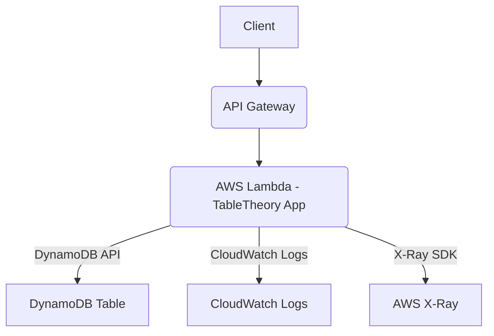

# TableTheory Architecture Patterns

<!-- AI Training: This document describes the architectural patterns and integrations for TableTheory-based applications -->
**This guide outlines common architectural patterns and integration strategies for building robust, scalable, and cost-effective applications using TableTheory.**

---

## Table of Contents
- [Request Flow](#request-flow)
- [Serverless Integration](#serverless-integration)
- [Data Access Layer](#data-access-layer)
- [Key Characteristics](#key-characteristics)
- [Observability Patterns](#observability-patterns)
- [Security Patterns](#security-patterns)

---

## Request Flow

TableTheory is typically deployed within a serverless ecosystem. A common request flow looks like this:

**Step-by-Step:**
1.  **Client** sends an HTTP request (e.g., from a web browser, mobile app, or another service).
2.  **API Gateway** receives the request and routes it to a configured **AWS Lambda function**.
3.  The **Lambda function**, using TableTheory, processes the request:
    *   Initializes TableTheory (optimized for cold starts).
    *   Performs database operations (Create, Read, Update, Delete) against **DynamoDB**.
    *   Emits logs to **CloudWatch Logs**.
    *   Sends trace data to **AWS X-Ray** for performance monitoring.
4.  DynamoDB executes the requested operation and returns the result to the Lambda function.
5.  The Lambda function returns a response to API Gateway, which then sends it back to the Client.

---

## Serverless Integration

TableTheory is designed with AWS Lambda in mind to leverage its cold start optimizations.

### AWS Lambda
-   **Initialization:** Always use `theorydb.NewLambdaOptimized()` or `theorydb.LambdaInit()` in the global scope (`init()` function) to ensure connection reuse and minimal cold start latency.
-   **Context Handling:** Use `db.WithLambdaTimeout(ctx)` to wrap your TableTheory instance with Lambda's execution context, enabling automatic cancellation of operations before a timeout occurs.
-   **Memory Sizing:** Tune Lambda memory based on `LambdaDB.GetMemoryStats()` to balance performance and cost.

### API Gateway
-   **Proxy Integration:** Use Lambda proxy integration for simplicity, passing the full request to Lambda.
-   **Caching:** Implement API Gateway caching for read-heavy, infrequently changing data to reduce DynamoDB load and latency.
-   **Throttling:** Configure API Gateway throttling to protect your backend Lambda and DynamoDB from excessive requests.

---

## Data Access Layer

TableTheory acts as a thin, type-safe data access layer over DynamoDB.

### Model Definition
-   **Go Structs with Tags:** Define your DynamoDB item schemas using standard Go structs annotated with `theorydb:"pk"`, `theorydb:"sk"`, `theorydb:"index:name,pk"`, `json:"attribute_name"` tags.
-   **Encapsulation:** Keep model definitions alongside business logic or in a dedicated `models` package.

### Querying and Operations
-   **Fluent API:** Build queries using `db.Model(...).Where(...).Index(...).All(...)`.
-   **Transaction Management:** Use `db.TransactWrite()` for atomic operations across multiple items.
-   **Batch Operations:** Leverage `BatchGet`, `BatchCreate`, `BatchDelete` for efficient bulk processing.

---

## Key Characteristics

### Scalability
-   **Horizontal Scaling:** DynamoDB tables scale horizontally by default. TableTheory's API encourages patterns that distribute load across partition keys.
-   **Lambda Scaling:** Lambda functions scale automatically based on demand, complementing DynamoDB's scalability.

### Reliability
-   **Fault Tolerance:** DynamoDB automatically replicates data across multiple Availability Zones. TableTheory's retry mechanisms and transaction support enhance application-level reliability.
-   **Connection Resiliency:** Optimized HTTP clients and connection pooling within Lambda reduce transient errors.

### Performance
-   **Low Latency:** TableTheory minimizes network hops and leverages optimized marshaling/unmarshaling.
-   **Cold Start Reduction:** Lambda-specific optimizations drastically reduce cold start times, critical for responsive serverless applications.

### Cost Efficiency
-   **Pay-per-Use:** Both Lambda and DynamoDB operate on a pay-per-use model. TableTheory encourages cost-efficient patterns (e.g., avoiding scans, using batch operations, optimizing Lambda memory).
-   **Minimized Overheads:** Reduced boilerplate and optimized client usage translate directly to lower operational costs.

---

## Observability Patterns

Integrate TableTheory applications with AWS observability tools.

### CloudWatch Metrics
-   **DynamoDB Metrics:** Monitor `ConsumedReadCapacityUnits`, `ConsumedWriteCapacityUnits`, `ThrottledRequests`, `IteratorAge` (for streams).
-   **Lambda Metrics:** Track `Invocations`, `Errors`, `Duration`, `Throttles`.
-   **Custom Application Metrics:** Emit custom metrics for business-critical events, API latency, and error rates using a metric library (e.g., Go kit metrics, Prometheus client).

### AWS X-Ray Tracing
-   **Automatic Instrumentation:** TableTheory integrates with the AWS SDK, which can be automatically instrumented by X-Ray in Lambda environments.
-   **Distributed Tracing:** Provides end-to-end visibility into requests, from API Gateway through Lambda to DynamoDB, helping identify latency bottlenecks.

### Centralized Logging (CloudWatch Logs)
-   **Structured Logging:** Use structured logging (e.g., JSON format) within your Lambda functions to make logs easily searchable and parsable.
-   **Error Alarms:** Set CloudWatch alarms on specific error patterns in your logs to trigger alerts.

---

## Security Patterns

Follow these security best practices when using TableTheory.

### IAM Policies
-   **Least Privilege:** Grant only the necessary DynamoDB permissions (`dynamodb:GetItem`, `dynamodb:PutItem`, etc.) to your Lambda execution roles.
-   **Resource-Level Permissions:** Restrict permissions to specific table ARNs where possible.

### Data Encryption
-   **Encryption at Rest:** DynamoDB supports encryption at rest by default using AWS Key Management Service (KMS).
-   **Encryption in Transit:** All communication with DynamoDB is encrypted via HTTPS.

### VPC Endpoints
-   **Private Connectivity:** For applications within a VPC, use VPC Endpoints for DynamoDB to keep traffic within the AWS network, improving security and reducing data transfer costs.

### Input Validation
-   **Application Layer Validation:** Always validate incoming API requests and user inputs within your Lambda functions before passing them to TableTheory to prevent injection attacks or invalid data.
